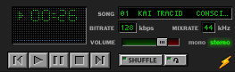

Cześć,

Pierwszym zadaniem w tym semestrze będzie
do napisania aplikacja desktopowa do słuchania muzyki.
Aplikacja powinna mieć układ podobny do tego, który jest w załączniku.
Nie musi być odwzorowania jeden do jeden, natomiast ważne jest użycie
właściwych układów do pozycjonowania przycisków czy informacji o piosence.
Aplikacja powinna wyświetlać aktualny czas utworu, tytuł piosenki,
parametry bitrate i mixrate, suwak z poziomem głośności.
Ponadto powinna posiadać przyciski:
- następnej piosenki
- poprzedniej piosenki
- uruchomienia piosenki
- zapauzowania piosenki
- rozpoczęcia tej samej piosenki od samego początku
oraz przyciski shuffle do losowania następnego utworu z listy i przycisk loop
odtwarzający utwór w pętli.
  
Domyślnie po skończeniu utworu przechodzimy do następnego na naszej playliście.
Nie trzeba implementować switcha mono/stereo.
Odtwarzane utwory są plikami mp3, które znajdują się w folderze z projektem.
Praca domowa nie musi być napisana w pythonie. Natomiast musi być użyta
jedna z poniższych technologii:
  
- C++/C# – Windows Forms lub WPF lub MAUI lub Xcode lub Qt
- Python – PyQt
- JAVA – Swing lub Qt
Nie wysyłam żadnych plików mp3.
W razie wątpliwości zadawajcie pytania jak jestem w szkole.

